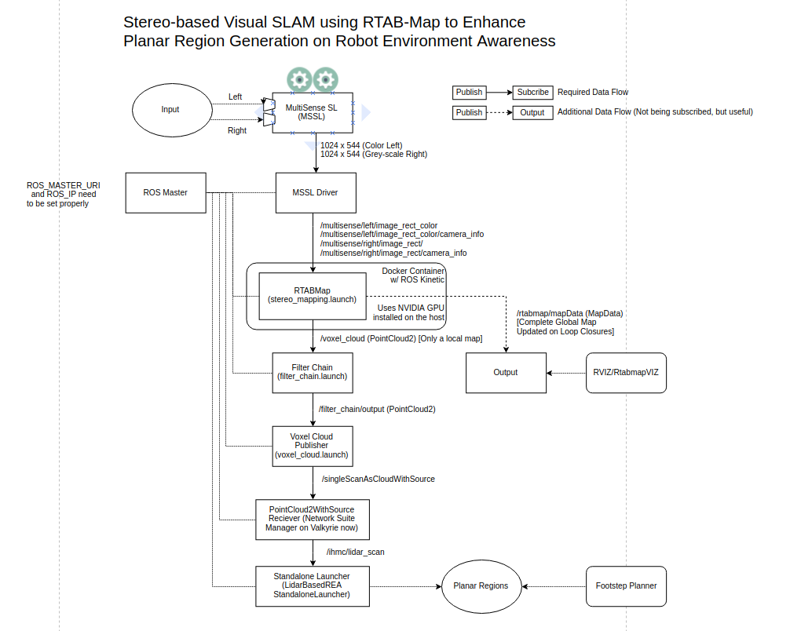

# Stereo-based Visual SLAM using RTAB-Map

## Dependencies

Ubuntu 14.04 or above  
Docker  
NVIDIA Driver

## Instructions to setup the environment

* Install Docker on the Workstation if it is not already installed.
* Clone "IHMC Open Robotics Software" onto the Workstation and checkout the branch "feature/rtab-slam"
* Clone "IHMC Multisense Tools" onto the workstation and checkout the branch "feature/rtab-slam"
* Change directory into "Kinetic3D" inside "ihmc-open-robotics-software/ihmc-perception"
* Use command `nvidia-smi` to get the driver version number for the NVIDIA Graphics Card installed on the workstation
* Download this exact NVIDIA driver version form the NVIDIA website into the Kinetic3D directory.
* Run the command `sudo bash docker.sh build` to build the `kinetic3d:latest` Docker Image 
* Accept and select "Yes" for any X-Server prompts during the process of Docker build for the image.
* Execute the command `xhost +` on the Ubuntu host machine CLI
* Use the command `sudo bash docker.sh run` to launch the Docker container from the `kinetic3d:latest` image
* Once the MultiSense driver is publishing the left and right camera image and info topics, launch the `stereo_mapping.launch` using Roslaunch.

## Instructions to setup the remaining Data Flow

### Refer to the diagram below to setup the remaining part of the pipeline to enable the REA to generate Planar Regions

## Data Flow Diagram for the RTAB-Map Visual SLAM Integration with Robot Environment Awareness (REA)  

  

## Final Result Video  

[[embed url=https://www.youtube.com/watch?v=fF9qEaRX50I]]  

Please look at the following two link. There is an amazing level of documentation in them.  
Github Wiki: https://github.com/introlab/rtabmap/wiki  
Documentation: http://introlab.github.io/rtabmap/  
Author: Bhavyansh Mishra  
